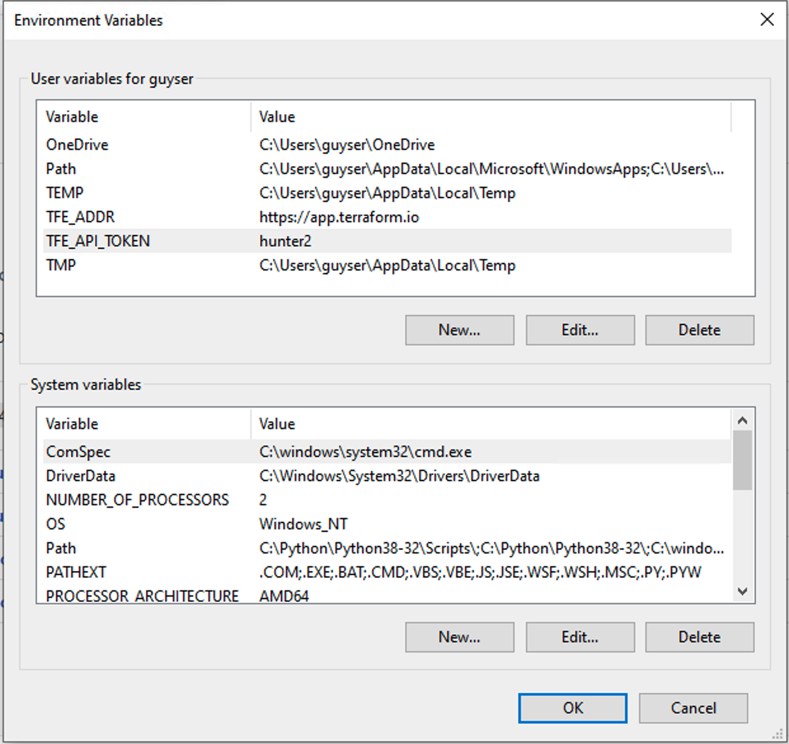

# terraform-enterprise-counter
A simple project to count Organizations, Workspaces and Runs.

## set up
This project requiressome  environment variables to run:
* TFE_ADDR - URL of the TFE instance you want to query (defaults to Terraform Cloud)
* TFE_TOKEN - API Token to be used, this code will try and find all resources this token has access to (defaults to blank and will generate an error if not provided)
* TFE_SITE_ADMIN - if the above token has site admin right use a different api (true/false defaults to false)
* TFE_FILTER_START_DATE - start date in dd.mm.yyyy format runs and applies before this date will be ignored (defaults to 31.12.2020)
* TFE_FILTER_END_DATE - end date in dd.mm.yyyy format runs and applies after this date will be ignored (defaults to today() ) 

### on Mac/Linux:
```bash
export TFE_ADDR=https://app.terraform.io
export TFE_API_TOKEN=hunter2
export TFE_SITE_ADMIN=false
export TFE_FILTER_START_DATE='31.12.2020'
export TFE_FILTER_END_DATE='28.08.2021'
```

### on Windows:




### Docker:
```bash
docker build .
```

## how it works
if the env variable "TFE_SITE_ADMIN" is set to true, this code uses the admin apis to count the workspaces(and their status).

if the TFE_SITE_ADMIN env var is set to false, this project will use the api token to list all the Organizations it has access to. then, it will list all the workspaces in each org and count the runs for each workspace. this all goes into a dict list and is then sent to pandas as a Dataframe.

 due to the simplicity of the code it should be fairly simple to extend the code to your necessities.

## output

an example output of the project:

```bash
                            name  workspace_count  total_runs
0                 andygrifdemo                   2          24
3         emea-se-playground-2019               20         243
4            example-organization               12         158
6                       GuyBarros                5           0
7              Hashicorp-neh-Demo               20         135
8           hc-emea-sentinel-demo                8          47
11                    rgustso                    6          58
12                   RogerBe                    20         242
13                      rusty-pro               15         148
15                  SNOW-se-demos               20          58
16                  TaimurKOrg                   2          14
'Total workspaces count: 167'
'Total runs count: 1503'
```
note: I've omitted some customer facing organizations so the sums wont add up.

### running the code
    there are different choices: python, binary, docker. all the options work in similar fashion: export the env variables and run the code 😀.


#### Python

```bash
export TFE_ADDR=https://app.terraform.io
export TFE_API_TOKEN=hunter2
export TFE_SITE_ADMIN=false
python main.py
```

#### binary 
the Binaries for different OSes can be downloaded from releases. these binaries where created with PyInstaller.

```bash
wget https://github.com/GuyBarros/terraform-enterprise-counter/releases/download/v0.0.1/tfe_counter_darwin_amd64
export TFE_ADDR=https://app.terraform.io
export TFE_API_TOKEN=hunter2
export TFE_SITE_ADMIN=false
./tfe_counter_darwin_amd64
```

#### Docker

the easy way to do this is add the env variables to the Dockefile and run:

```bash
docker build .
```
#### TODO

* update binary packages with date filter


